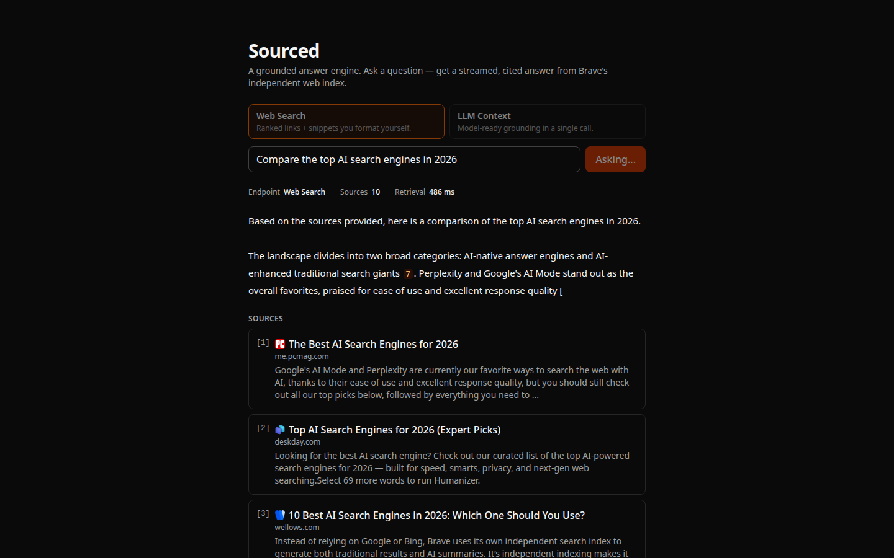
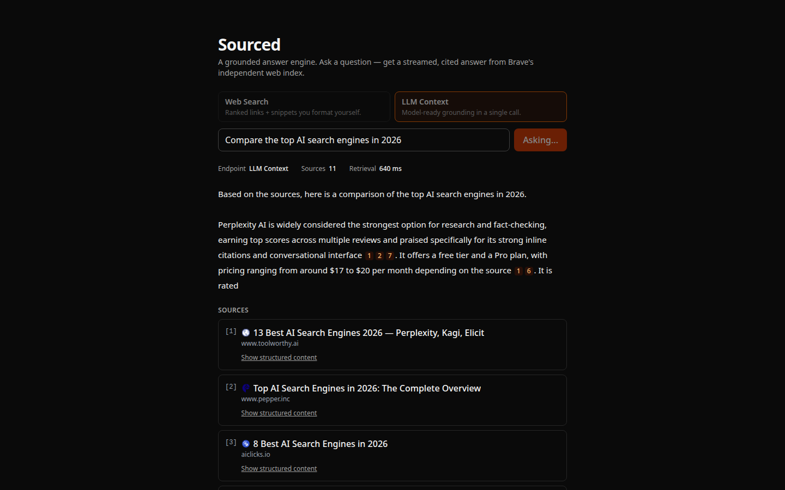
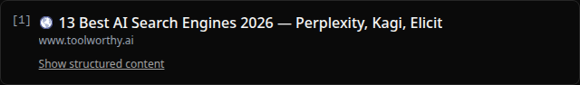

# Sourced

Sourced is a working reference app for the [Brave Search API](https://brave.com/search/api/),
built for developers evaluating Brave for RAG and agent use cases. It exists to
make one tradeoff visible: Brave's two retrieval endpoints — **Web Search** and
**LLM Context** — behind a single toggle, with source count and retrieval latency
shown on every query.

**Live demo:** https://sourced-zeta.vercel.app



## Time to first call

Clone, add two keys, run — about five minutes. Requires Node 20+ and pnpm
(`corepack enable pnpm` if you don't have it).

```bash
git clone https://github.com/kbennett2000/sourced
cd sourced
pnpm install

cp .env.example .env.local      # then fill in the two keys (see below)
pnpm dev                        # http://localhost:3000
```

`.env.local` needs:

| Variable | Where to get it |
| --- | --- |
| `BRAVE_API_KEY` | [Brave Search API dashboard](https://api-dashboard.search.brave.com) — subscription token |
| `ANTHROPIC_API_KEY` | [Anthropic Console](https://console.anthropic.com) — `sk-ant-...` |

> The `Search` plan (from $5/1K, with a $5 free monthly credit) covers both
> endpoints the toggle uses — no separate subscription needed.

Optional: `RATE_LIMIT_MAX` (default 30) and `RATE_LIMIT_WINDOW_MS` (default
3600000 = 1h) tune the per-IP limit.

## Two endpoints, one toggle

Both endpoints answer the same question; they differ in who does the work of
turning the web into grounding context.

- **Web Search** (`/res/v1/web/search`) — ranked links + snippets. *You* decide
  how many results to pass and how to format them. Best when you want control
  over the grounding, clean per-result snippets, and obvious source diversity.
- **LLM Context** (`/res/v1/llm/context`) — relevance-ranked, model-ready content
  in a single call, purpose-built for AI grounding. Best when you want Brave to
  do the chunking/ranking for you. The tradeoff: you get more, denser context
  with less control over formatting — some chunks arrive as raw JSON or tables
  rather than prose (Sourced detects these and renders them collapsed).

The stats bar surfaces `source_count` and `retrieval_ms` per run so the
difference is visible rather than described.



*The same question on each endpoint — the stats bar shows the difference in
source count and retrieval latency. That visible diff is the whole point.*

LLM Context sometimes returns JSON or table chunks instead of prose; Sourced
detects these and collapses them behind a toggle rather than dumping raw markup
into a source card:



## How it works

```
Browser → POST /api/answer { question, endpoint }
  → validate (Zod) → rate-limit (per IP)
  → retrieve via lib/brave.ts (Web Search or LLM Context) → normalized Source[]
  → ground (lib/prompt.ts) → streamText(claude-sonnet-4-6)
  → response: NDJSON prelude line { endpoint, retrieval_ms, source_count, sources }
    followed by the streamed answer text
```

The client reads the prelude (source cards + stats), then renders the streaming
answer, turning inline `[n]` markers into pills that scroll to the matching
source card. See [docs/architecture.md](docs/architecture.md) for the full shape
and the [ADRs](docs/adr/) for key decisions (stack, stream transport, rate limit).

## Tests

> Pure-function + mocked-route only — runs in ~1s and needs no API keys.

```bash
pnpm test        # vitest, runs in ~1s
pnpm typecheck   # tsc --noEmit (strict)
pnpm lint        # eslint
```

Covered: the Brave client (normalization + error handling for both endpoints),
the stream prelude builder, the `[n]` citation parser, the snippet classifier
(prose vs JSON/table/code), the rate limiter (cap + window + reset), and the
answer route (rate-limit headers + 429 shape, with the AI SDK mocked).

## Deploy

Deployed on Vercel. The app builds without keys (env validation is lazy, runtime
only), so the first deploy succeeds and the API returns 500 until you add the
two secrets.

```bash
pnpm dlx vercel link
pnpm dlx vercel --prod
# add BRAVE_API_KEY and ANTHROPIC_API_KEY for Production (dashboard or
# `vercel env add`), then redeploy so the deployment picks them up:
pnpm dlx vercel --prod
```

No `vercel.json` is needed — the route declares `runtime = "nodejs"` itself.

## What I'd add next

- **Compare mode** — run both endpoints in parallel for one question and show the
  answers + stats side by side (the toggle, taken to its logical conclusion).
- **Durable rate limiting** — swap the in-memory limiter for Upstash Ratelimit so
  limits are shared across serverless instances (see
  [ADR 0003](docs/adr/0003-ratelimit-strategy.md)).
- **MCP server** — expose the grounded-answer flow as an MCP tool; Brave is a
  leading MCP search backend, so this is a natural fit.
- **More Brave endpoints** — news, images, and video for richer answers.

And if this were a real Brave-published reference, [docs/launch-playbook.md](docs/launch-playbook.md)
sketches how I'd ship the surrounding content — blog, notebook, launch-day
channels, community norms, and the metrics that would actually matter.

See [CUSTOMER-ZERO.md](CUSTOMER-ZERO.md) for friction encountered while building
this, with suggested fixes.
